# StartupCo Security Refactor

## Problem Statement

StartupCo moved quickly to launch its product, which created a cloud environment with functional infrastructure but weak security controls and inconsistent governance. The current work is about bringing that environment under proper engineering and security discipline, focusing on users, permissions, observable state, threat detection, and Infrastructure as Code.

For the detailed rationale behind each decision, see [docs/decisions.md](docs/decisions.md).

## Video Overview

A short video discussing the `decisions.md`, `README.md`, and the Terraform Import process for this project is available by clicking on the image below:

<a href="https://www.loom.com/share/0169d090954b4db380109cc05294215a">
  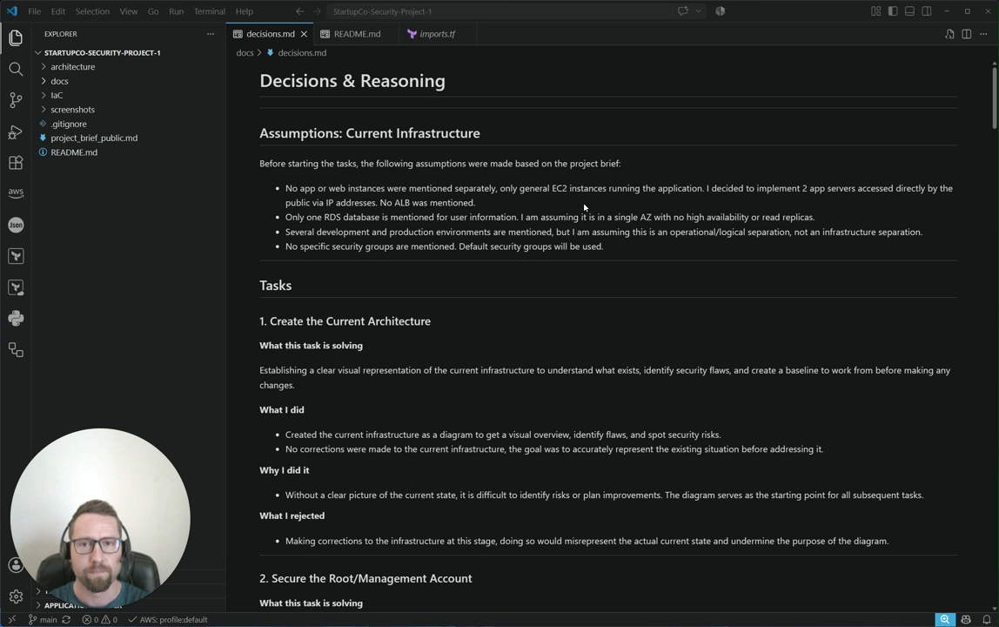
</a>

Although Task 8 in the `decisions.md` document covers this in more detail, the short version is that I never assumed my Terraform code was correct simply because it looked consistent. Instead, I imported resources sections one at a time and reviewed each plan diff before proceeding, comparing the intended outcome documented in the project decisions, the Terraform IaC code, and the actual live AWS state against one another.

A clean `Terraform plan` shows that the code accurately describes what is currently running, rather than that it has recreated it.

## Current State Diagram

The first step was to understand the existing architecture and identify risks in the live environment.

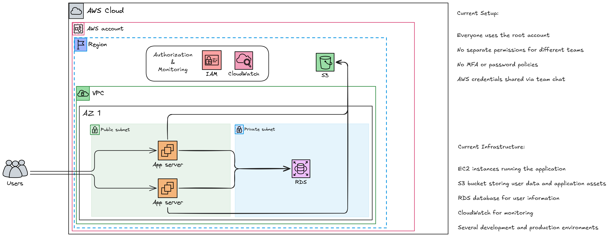

This diagram captured the current single-AZ app/RDS topology and exposed the need for stronger network segmentation, role-based access control, and detective security.

## Actions Taken (Build Order)

### 1. Create the Current Architecture

- Built a visual current-state diagram to capture the actual AWS setup.
- Kept it as a discovery artifact, not a corrective design.
- Used it as the baseline for everything that followed.

### 2. Secure the Root Account

- Enabled MFA on the AWS root/management account.
- Documented root credential storage in an encrypted password manager.
- Confirmed that access keys are only created for IAM users.
- Clarified that this account is the governance/control plane and, in an enterprise model, should not be used to host workload IAM users/groups or application infrastructure once AWS Organizations is established.

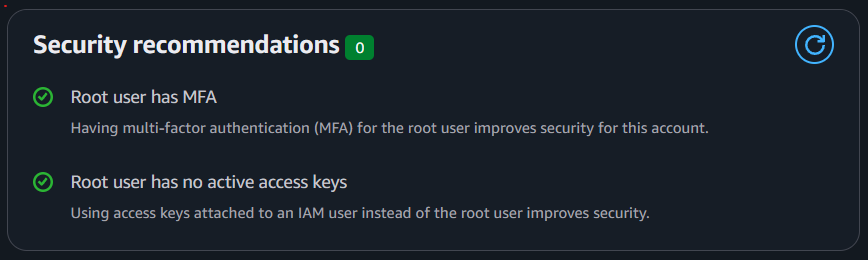

### 3. Create IAM Users and Groups

- Replaced shared root access with individual IAM users.
- Organized users into role-based groups: Developers, Operations, Finance, and Data Analysts.
- Attached permissions at the group level to enforce least privilege.

### 4. Set Up the Security Baseline

- Created the `Force-MFA` policy in the console and Terraform.
- Applied it to all groups so every user requires MFA.
- Documented the policy and the MFA setup process.

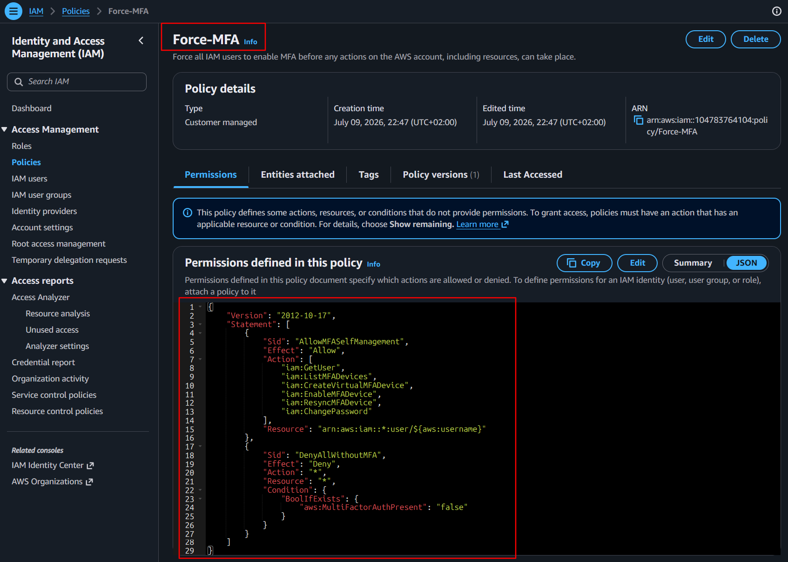

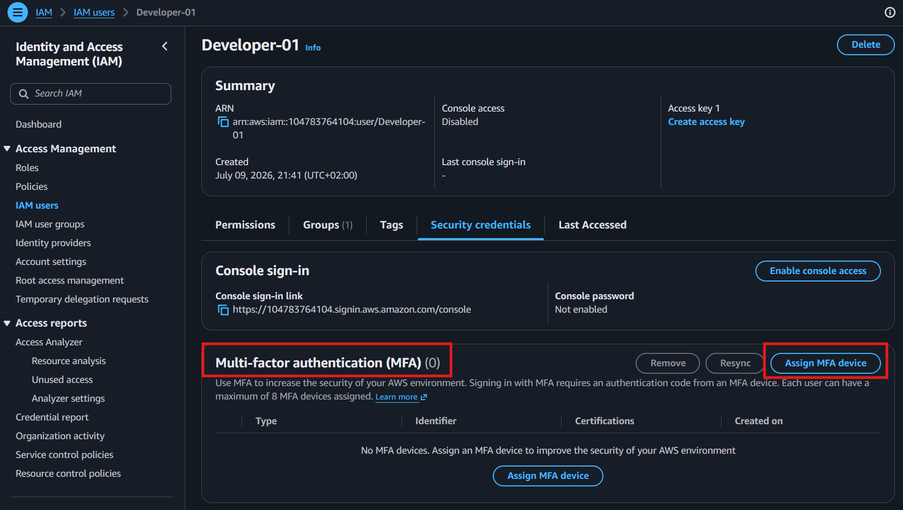

### 5. Implement User Group Permissions

- Assigned AWS managed policies per role:
  - Developers: EC2 full access, S3 full access, CloudWatch Logs read-only.
  - Operations: EC2 full access, CloudWatch full access, SSM full access, RDS full access.
  - Finance: Billing, ReadOnly access.
  - Data Analysts: S3 read-only, RDS read-only.
- Verified billing access requirements in the root account.

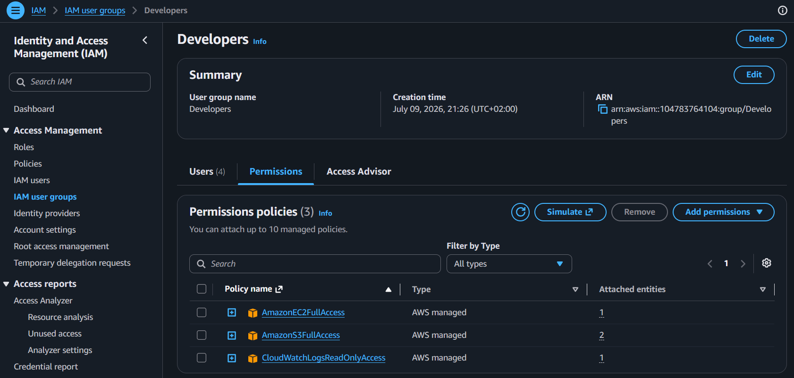

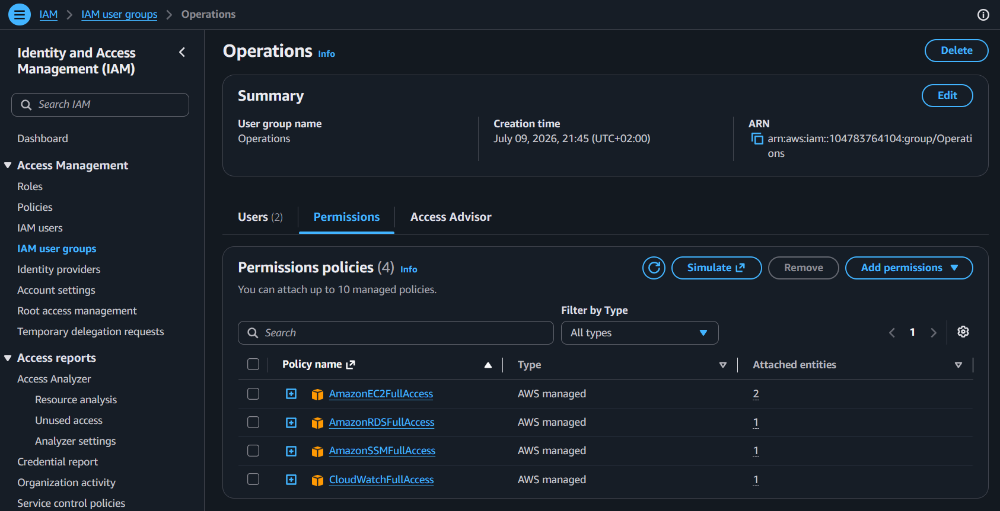

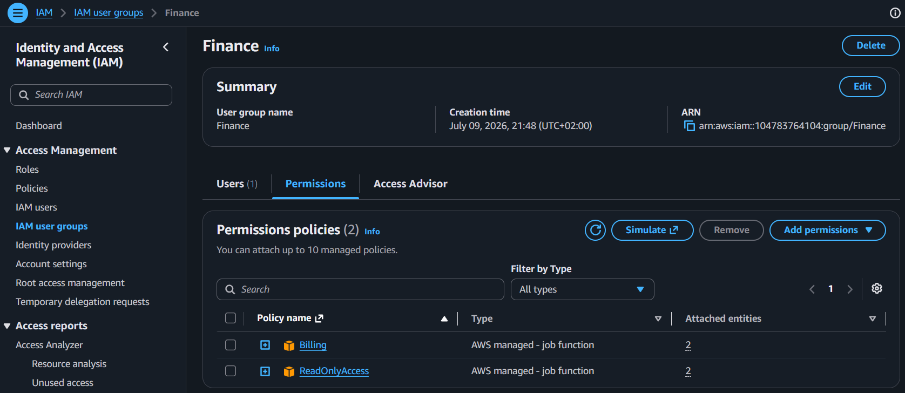

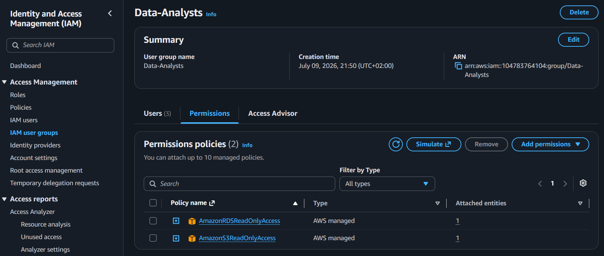

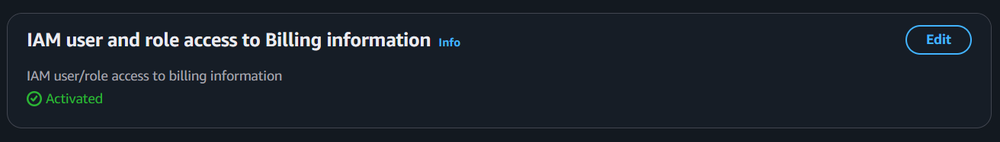

### 6. Recreate the Solution as Infrastructure as Code

- Reimplemented the current IAM design in Terraform.
- Added the following files:
  - `main.tf` for backend/provider configuration and S3 native locking.
  - `iam_groups.tf` for group resources and permission attachments.
  - `iam_users.tf` for individual IAM users and group memberships.
  - `iam_policies.tf` for the custom MFA enforcement policy.
  - `imports.tf` to maintain imported state mappings.
- Updated `.gitignore` to exclude Terraform state and generated files.

### 7. Enable GuardDuty as a Future-Ready Detection Layer

- Added GuardDuty in Terraform (`guardduty.tf`) as the target-state security layer.
- Did not enable it in the live account in this phase due to cost sensitivity.
- Documented the planned detective capability alongside the actual deployed subset.

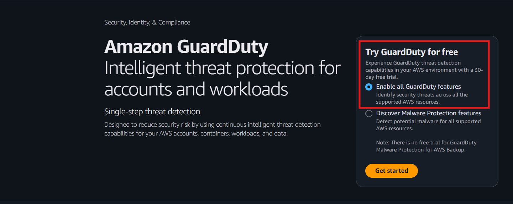

### 8. Terraform Import Verification

- Used `terraform import` to reconcile existing console IAM resources with Terraform resources.
- Imported groups, users, policies, and attachments one at a time.
- Reviewed the plan after each import to confirm the code matched live state.
- Preserved GuardDuty as an un-applied, future-ready configuration.

### 9. Target-State Architecture

- Developed a future-ready target-state architecture after completing the IaC reconciliation.
- Designed a multi-AZ, multi-tier topology with public and private subnets.
- Added an ALB, private App + DB tier, NAT gateway, multi-AZ RDS, VPC gateway endpoint for S3, and layered security groups.
- Included CloudWatch and GuardDuty in the target-state security model.

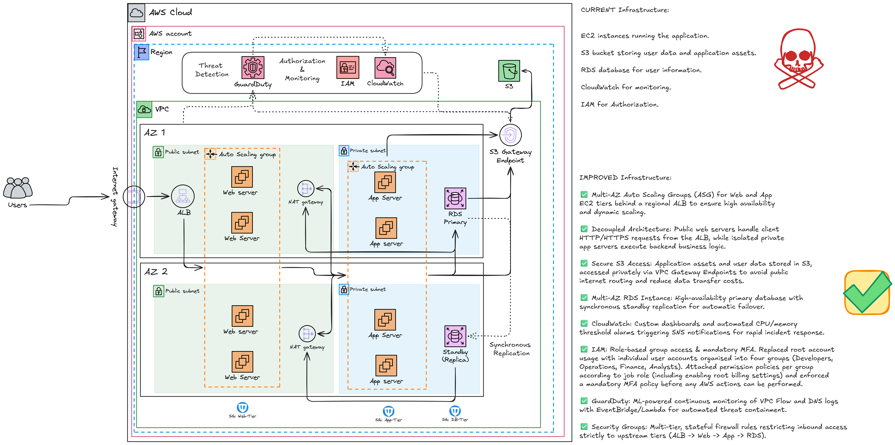

### 10. IAM Structure Diagram

- Created a dedicated visual reference for the current IAM role/group/policy layout.
- Confirmed that permissions flow through groups, not directly to users.
- Used the diagram to make the IAM model easier to review and validate.

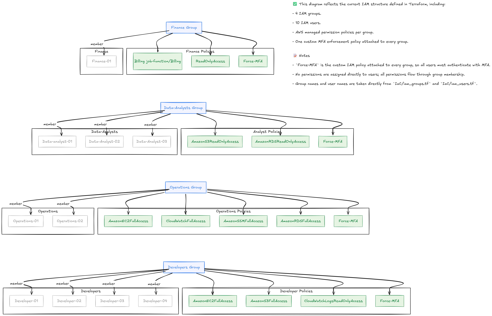

## Why These Decisions

The decisions were driven by three practical goals:

1. Verify what exists today before changing it.
2. Move the environment into repeatable, improved, codified infrastructure.
3. Add security controls without introducing unnecessary cost or complexity.

Key reasoning:

- The current environment was discovered and documented first to prevent assumptions from becoming requirements.
- Root account hardening and MFA enforcement protect the highest-risk access path.
- Role-based IAM groups align permissions with jobs and make policy management scalable.
- GuardDuty is a necessary detective capability, but it is documented as a future deployment when the startup can absorb the cost.
- Import verification ensures Terraform is managing the real resources, not just the intended design.

## Security Section

### Root and MFA

- Root account MFA is enabled and root credentials are handled as an emergency asset.
- All IAM users inherit a custom `Force-MFA` policy via group attachments.

### Least-Privilege IAM

- Permissions are assigned at the group level, not directly to users.
- Group membership defines access scope, which keeps the model manageable and auditable.

### Detective Controls

- GuardDuty is included in the target-state architecture for continuous anomaly detection.
- The current phase keeps GuardDuty as a documented future capability to balance cost and security.

### Infrastructure Validation

- Terraform import verification proves the code and the live account are aligned.
- Each plan diff was reviewed before accepting changes.

## Target-State and IAM Diagrams

The repository now includes visual references for both the current and future state:

- `screenshots/01-Current-State-Architecture-Diagram.png`
- `screenshots/09-Target-State-Architecture-Diagram.png`
- `screenshots/10-IAM-Structure-Diagram.png`
- `architecture/Current State - Architecture Diagram.excalidraw`
- `architecture/Target State - Architecture Diagram.excalidraw`
- `architecture/IAM Structure Diagram.excalidraw`

These diagrams are intended as documentation, not replacement for the Terraform source of truth.

## Infrastructure as Code

The project is implemented in Terraform with the following key files:

- `main.tf` — provider and remote state configuration.
- `iam_groups.tf` — IAM groups and policy attachments.
- `iam_users.tf` — IAM user definitions and group memberships.
- `iam_policies.tf` — custom `Force-MFA` policy definition.
- `guardduty.tf` — target-state GuardDuty configuration.
- `imports.tf` — state import helpers for existing resources.

This IaC approach makes the solution repeatable, version-controlled, and easier to audit.

## What I’d Do Differently at Scale

For a larger organization, this project should evolve into a multi-account, modular, and policy-driven platform.

First, harden the management/root account and use it as the governance account. Then use that account to create member accounts in AWS Organizations, and keep workload IAM users/groups inside those member accounts rather than in the management account.

- Partition the environment using AWS Organizations with separate accounts for prod, dev, security, logging, and shared services.
- Use federated identity or AWS IAM Identity Center instead of static IAM users in each account.
- Build reusable Terraform modules for network, compute, database, IAM, and security controls.
- Enforce guardrails through SCPs, permission boundaries, and automated policy-as-code checks.
- Separate remote state per environment/account, with locking and state isolation.
- Add CI/CD validation around `terraform fmt`, `terraform validate`, `tflint`, `tfsec`, and plan review.
- Treat GuardDuty and centralized security services as cross-account managed capabilities.
- Expand repo documentation with architecture docs, runbooks, tagging standards, logging/monitoring guidance, and recovery procedures.

This is the practical evolution path from a startup-friendly baseline to a scale-ready cloud security posture.

---

## Notes

- The existing `docs/decisions.md` contains the detailed reasoning behind each task.
- Screenshots are stored in the `screenshots/` folder.
- The current implementation is intentionally conservative on cost while still raising the security baseline.

## How to Review the Repository

1. Review the detailed architecture and reasoning in `docs/decisions.md`.
2. Validate the diagrams in `architecture/` and the `screenshots/` folder against the live AWS account.
3. Inspect the Terraform files in `IaC/` and confirm they match the imported IAM resources and current live state.
4. Confirm that the current implementation reflects the documented startup-safe security baseline.

## Future Next Steps

1. Decide whether GuardDuty should remain a documented future capability or be deployed now with cost controls in place.
2. Consider evolving the repository into a multi-account, module-based Terraform structure for production readiness.
3. Add CI validation around `terraform fmt`, `terraform validate`, `tflint`, `tfsec`, and pull-request plan review.
4. Expand documentation with architecture docs, operational runbooks, tagging standards, monitoring guidance, and recovery procedures.
 